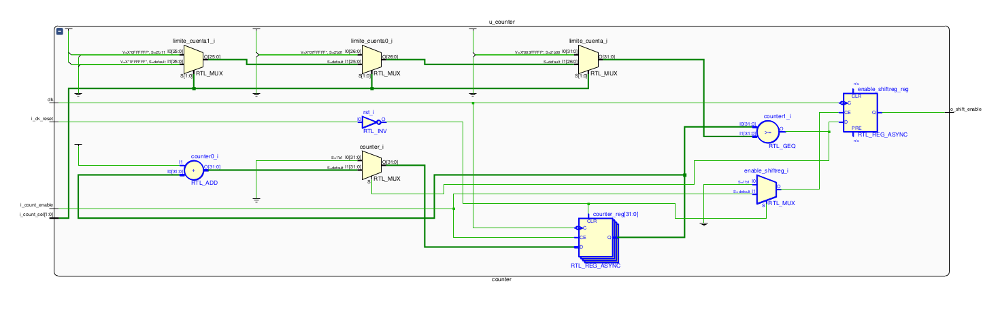
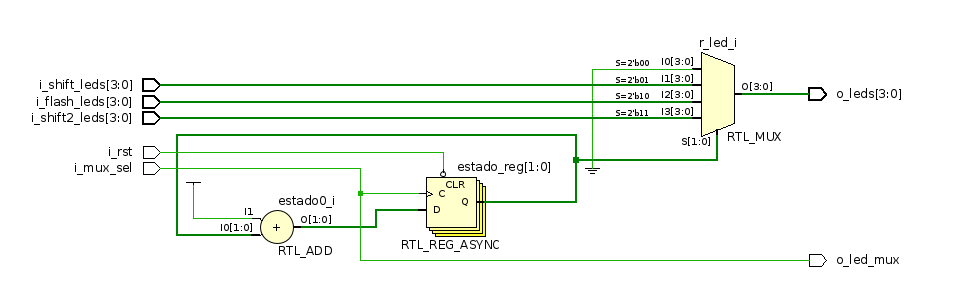

# Controlador de LEDs 

## Counter

Es el bloque formado por el **contador** de 32 bits, el **limite** del contador y el **comparador** para resetear el contador a cero una vez que se alcanzo la referencia

Está formado por  un bloque sumador (incrementa), un registro acumulador, 4 constantes, un reset asíncrono y un FF para la salida de habilitación de los otros módulos. 

De la simulación se puede observar como son producidos los pulsos de shift enable (mientras no se pulse el reset) y como cambia la elección de las constantes. 

## Shiftreg 

Este bloque se encarga de hacer un shift cada vez que recibe un shift_enable del módulo *counter* con una dirección determinada por un switch. 

Se trata de un registro con reset asíncrono y un multiplexor para la selección del shift. 

En la simulación podemos observar como por cada pulso de enable este bloque realizar un registro en la dirección determinada y luego cuando la variable *dir* toma el valor de 1 cambia de sentido el shift. 

## Flash 

Este bloque es simplemente un registro con un reset asíncrono y un negador, para que en cada ciclo de reloj se invierta la salida (efecto de flash) 

En la simulación se puede observar como se invierte el registro de LEDs mientras se encuentra habilitado este módulo. 

## Ledmux

Este bloque es simplemente un multiplexor con dos entradas de *N_LEDS* bits y una salida de *N_LEDS* bits también, estos bits son los estados de los leds que tomaran los correspondientes leds de colores según corresponda. 

En la simulación se observa como la salida toma el valor del vector de estados de LEDs del módulo flash o del módulo shiftreg a medida que el selector del mux cambia. 

## Leds 

Este módulo es el que se encarga de encender los LEDs del correspondiente color y de realizar el cambio. Es una máquina de estado que cambia solo cuando una combinación determinada de pulsadores ocurre. En caso que esa combinación no suceda, no cambia de estado y al ser una máquina de Moore, tampoco la salida. 

En la simulación se puede observar que bloque de color de LEDs (o_led_r/g/b) toma el valor de la entrada *leds* según la combinación de los pulsadores *btn* 

Una implementación de máquina de estado finita estructurada como tal, se puede ver en la [descripción](./modulos/FSM_leds) en verilog aunque no se utilizó esta. 

## Shiftreg2leds 

Este modulo se agrega para el **ejercicio 2** y se lo implementó también como una máquina de estados para que cada estado sea un **paso de la secuencia** y la transición entre estados se logra mediante un sumador o un restador según la dirección indicada. El reset automático o el retorno al punto inicial de la secuencia se realiza por el overflow del registro contador. 

En la simulacion como alterna entre 0110 y 1001 con la dirección indicada según el selector. 

## seqmux 

Este módulo también se agrega para el ejercicio 2.  Y es una version similar a la del ejercicio solo que con una más y una logica combinacional para incrementar una variable *estado* que determina la salida del mutiplexor 

Se añade un reset, para resetear el registro de estados a cero 

## Consultas 

- [ ] Como evitar ROM en los diseños 

- [ ] Implementacion de Maq. de estados en verilog 

- [ ] Buenas practicas en top: ¿Es bueno manejar entradas en este modulo con algo de logica secuencia y combinacional o mejor que se solucione en cada modulo? 

- [ ] Es buena práctica poner en la sensitive list un pulsador o switch solo ? 

- [ ] Hace falta un reset ? Por mas que nosotros tengamos cubiertos  todos los estados? Si en algun estado tiene que caer en el arranque. 
